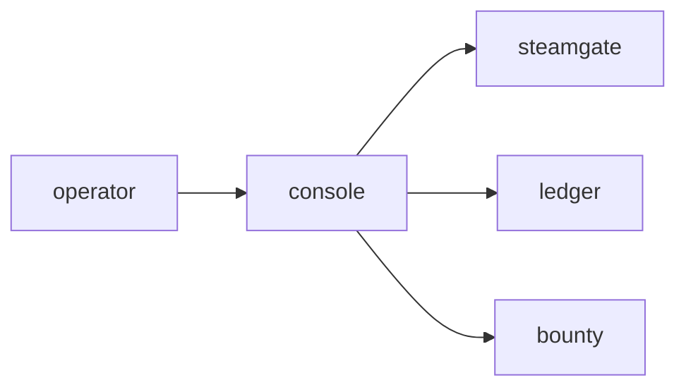

# Console

**Admin Console** — Secure dashboard for moderating users, economy, and Steam syncing.

Part of [ComputerPets](https://github.com/RicheyWorks/computerpets). Map: [computerpets-ecosystem](https://github.com/RicheyWorks/computerpets-ecosystem).

| | |
| --- | --- |
| Status | Design scaffold — contract frozen, implementation next |
| License | MIT |
| First pet | Still [Rui on the desktop](https://github.com/RicheyWorks/computerpets/blob/main/docs/START-HERE.md). This organ is optional. |

## The job

Operators, not players. Ban, freeze listings, replay a Steam ticket, and see whether the overlay fleet is healthy.

The flagship overlay already puts a living sticker on the real desktop (Rui first, 210 kinds). Console does not replace that. It is one organ.

## Who uses it

Operators only. RBAC. Not linked from Companion.

## What it is not

Not a player dashboard. Not a place to mint yourself a legendary.

## Architecture



## Stack

TypeScript · React 19 · Vite · Spring Boot admin API · Steam sync status · RBAC

GroupId / namespace: `com.enterprisepet.console`  
Default listen: `8080`

## Contract

### Data

`Operator(role) · Freeze(userId, reason, until) · SteamTicket(id, status)`

### Surface

- GET /admin/users — search, flags, Steam id
- POST /admin/users/{id}/freeze — halt trades + overlay cloud sync
- GET /admin/steam/sync — ticket backlog
- GET /admin/economy/anomalies — ledger alerts

### Failure doctrine

Missing admin role → 403, empty shell. Steam outage → show stale with banner. Accidental freeze → 15-minute undo window.

## First slice

Build this and stop. Do not boil the ocean.

**User search + freeze that halts Bazaar and Visitation. Undo window 15 minutes.**

You know it works when: Missing role: 403 empty shell. Steam outage: stale banner, no fake 'synced'.

## Environment

`ADMIN_OIDC`, `STEAMGATE_URL`, `LEDGER_URL`

Never commit secrets. Never put Steam or chain keys in the overlay.

## Neighbors

- computerpets Spring backend
- computerpets-steamgate
- computerpets-ledger
- computerpets-telemetry
- computerpets-bounty

## Layout

```
computerpets-console/
  README.md           this file
  LICENSE             MIT
  docs/CONTRACT.md    the same contract, frozen for implementers
  src/                implementation lands here
```

## Run (Windows)

PowerShell, from this folder, after the flagship helpers (Git, Node LTS 22+, JDK 21 as needed):

```powershell
cd app; npm install; npm run dev
```

You do not need this service to meet Rui. The [flagship start-here](https://github.com/RicheyWorks/computerpets/blob/main/docs/START-HERE.md) is still the first pet.

## Links

- Flagship: [RicheyWorks/computerpets](https://github.com/RicheyWorks/computerpets)
- This repo: [RicheyWorks/computerpets-console](https://github.com/RicheyWorks/computerpets-console)
- Map: [RicheyWorks/computerpets-ecosystem](https://github.com/RicheyWorks/computerpets-ecosystem)
- Contract file: [docs/CONTRACT.md](docs/CONTRACT.md)

## License

MIT. See [LICENSE](LICENSE).

---

*Two hundred ten living kinds. Keep them so a line does not go quiet.*
